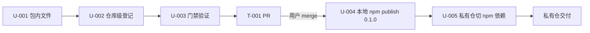

# 公开并发布 pi-session-tools 包

## Overview

把私有工作流仓（maplezzk/PiExtensions）中的 `pi-session-tools` 扩展包按公开仓（maplezzk/pi-extensions）规范发布：

1. 源码、测试、双语 README 进入公开仓 `packages/pi-session-tools`，接入 release-please 与 npm 发布链路；
2. npm 本地发布 0.1.0（用户在 2026-08-13 明确选择本地发布，不走 OIDC）；
3. 私有仓删除本地包副本，改走 npm 依赖，Pi 注册切换为 npm 包。

成功标准：公开仓 `npm run check` 全绿、npm 上存在公开包、私有仓不再持有该包源码。

## Problem Frame

- 现状：`pi-session-tools`（bash 管道输出缓存 + session_log/session_squash 三工具 + 上下文阈值提示）在私有仓已开发完成并交付使用（12 个单测、准入检查通过）。
- 问题：私有仓 AGENTS.md 约定公开包源码只在公开仓、消费方走 npm；私有仓继续持有源码违反该约定，且其他使用者无法安装。
- 约束：公开仓有硬性门禁（check-package-config.mjs / check-no-local-bindings.mjs / npm run check），包需双语 README、i18n 双语文案、依赖与 Pi 入口声明对齐既有包惯例。

## Scope Boundaries

- In scope：
  - 公开仓新增 `packages/pi-session-tools` 及仓库级发布配置；
  - npm 上发布 `pi-session-tools@0.1.0`；
  - 私有仓移除本地包并切换 npm 依赖、更新 Pi 注册。
- Out of scope：
  - 改动 pi-session-tools 功能逻辑本身（除兼容公开仓 i18n 0.3.x 的必要适配）；
  - 配置 npm OIDC trusted publishing（用户已选择本地发布）；
  - 私有仓其他包（pi-safety-guards / pi-workspace-tools / pi-tool-integrations）的公开化。

## Context & Research

- 本计划中 `packages/...`、`scripts/...` 均为公开仓（maplezzk/pi-extensions）repo-relative 路径；本任务工作副本根：`~/GitWorktree/publish-pi-session-tools/pi-extensions`。私有仓源码在私有仓 `pi-session-tools/`。

- 参照包：`packages/pi-metrics`（同仓库包结构、package.json 字段、tests/ 布局）、`packages/pi-dynamic-workflows`（typebox 依赖声明惯例）、`packages/pi-tool-supervisor`（pi.extensions 多入口惯例）。
- 门禁脚本：`scripts/check-package-config.mjs`（release-please/release.yml 登记、必填文件与字段、i18n 双语 key、i18n 依赖与入口）、`scripts/check-no-local-bindings.mjs`（/Users/ 路径、私有域名、i18n key 对齐）。
- 源码源：私有仓 `pi-session-tools/`（index.ts、src/ 四个文件、locales/i18n.json 134 行双语、README 中文 31 行）。
- 已验证：源无 `/Users/` 路径与 `console.*`；`pi-extensions-i18n@0.3.1` 的 `createTranslator`/`loadCatalog` 与私有用法同形；npm 上 `pi-session-tools` 名未被占用；公开仓无 open issue 与本任务冲突。

## Key Technical Decisions

- 公开仓 package.json 依赖声明：`pi-extensions-i18n` 进 `dependencies`（^0.3.1，门禁强制）；`typebox` 按 `pi-dynamic-workflows` 惯例进 `peerDependencies`（"*"）+ `devDependencies`（lockfile 已解析 1.1.38）；`@earendil-works/pi-coding-agent` 保持 peer `>=0.80.0 <0.81.0`。
- 测试随包迁移：私有仓根 `tests/unit/session-tail-compaction-utils.test.ts` 移入 `packages/pi-session-tools/tests/`，import 改为 `../src/...`；私有仓根 test 脚本同步删除该行。
- README：`README.md` 为完整英文版（翻译现有中文内容），`README.zh-CN.md` 为现有中文内容，安装方式改为 `pi install npm:pi-session-tools`（对齐公开仓 README 惯例）。
- 英文 README 由执行 Agent 翻译生成（用户 2026-08-13 确认）。

### ADR-1. 首次 npm 发布走本地 publish，不走 OIDC
- 决策：`pi-session-tools@0.1.0` 由本地 `npm publish`（public access）发布。
- 备选：先创建 npm 空包 + 配置 trusted publishing，合并 release PR 后由 CI OIDC 发布。
- 权衡：本地发布无需提前配置 npm 侧 trusted publisher，路径短；但需本机 npm 登录态，且 release-please 后续版本 PR 合并时 publish job 会因"版本已存在"失败一次（fail-fast: false，不连累其他包，可接受）。
- 可逆性：难（npm 版本不可覆盖；后续版本转 OIDC 即可恢复标准链路）。

## Open Questions

- Resolved during planning：
  - 私有仓去留 → 发布后切换 npm 依赖（用户 2026-08-13）；
  - npm 发布方式 → 本地 publish（用户 2026-08-13）；
  - 英文 README → 执行 Agent 翻译（用户 2026-08-13）。
- Deferred to implementation：
  - 本机 npm 登录态是否存在 → U-004 执行时检查，无登录态则阻塞并请用户 `npm login`；
  - 私有仓交付方式（直推 master 或 MR）→ U-005 执行时按私有仓既有惯例确认。

## High-Level Technical Design

U-001..U-003 构成 T-001（公开仓一张 PR）；U-004..U-005 构成 T-002（blocked_by T-001）。

## Implementation Units

### U-001. 包内文件落地 packages/pi-session-tools

- **Goal:** 公开仓出现结构、依赖声明、测试齐全的 pi-session-tools 包。
- **Requirements:** Overview 第 1、2 点；门禁 REQUIRED_FILES 与 REQUIRED_PKG_FIELDS。
- **Dependencies:** none
- **Files:**
  - Create: `packages/pi-session-tools/index.ts`、`src/*.ts`（4 文件）、`locales/i18n.json`、`tsconfig.json`、`tests/session-tail-compaction-utils.test.ts`、`README.md`、`README.zh-CN.md`、`package.json`
- **Approach:** 从私有仓复制源码与 i18n；测试 import 改 `../src/session-tail-compaction-utils.ts`；package.json 对齐公开仓惯例（main/exports、files 不含 tsconfig、pi.extensions 含 `../pi-extensions-i18n/index.ts`、homepage/bugs/publishConfig、author maplezzk、dependencies i18n ^0.3.1、peer typebox "*"、scripts test 指向 tests/*.test.ts）；README 双语，安装为 `pi install npm:pi-session-tools`；`src/bash-output-cache.ts` 中硬编码中文缓存提示（约 85 行 tool_result 追加文案）移入 `locales/i18n.json` 双语 key 并经 i18n.t() 生成（审查 F-003）。
- **Behavior boundary:** 不修改任何功能行为；对外契约 = 包名、三工具与两扩展入口不变；唯一源码适配 = 缓存提示走 i18n 双语。
- **Patterns to follow:** `packages/pi-metrics`（包布局）、`packages/pi-dynamic-workflows`（typebox 声明）、`packages/pi-extensions-i18n` 的 `createTranslator`/`loadCatalog`。
- **Acceptance scenarios:**
  - Happy path: `npm run typecheck` 与 `npm test`（workspace 级）通过，包级 `npm pack --dry-run` 成功。
  - Edge/error: i18n.json 每个 key 同时有 zh-CN/en-US；files 数组含两个 README。
  - Integration: 新包不 import 其他包私有实现，仅 `pi-extensions-i18n`。
- **Verification:** 包级 `npm run check`（typecheck+test+pack dry-run）通过；grep 无 `/Users/`、无 `console.`。

### U-002. 仓库级发布与文档登记

- **Goal:** 新包进入 release-please、CI 发布矩阵与仓库文档。
- **Requirements:** 门禁 check 1/2（release-please 登记、release.yml matrix 覆盖）。
- **Dependencies:** U-001
- **Files:**
  - Modify: `release-please-config.json`（+`packages/pi-session-tools: {}`）、`.github/workflows/release.yml`（matrix +`- dir: packages/pi-session-tools`）、`README.md`、`README.zh-CN.md`（包表 + 行）、`AGENTS.md`（仓库地图 + package boundary）、`package-lock.json`（npm install 刷新）
- **Approach:** 按现有条目格式逐处追加；lockfile 在 worktree 内 `npm install` 生成。
- **Behavior boundary:** 不改其他包的版本、脚本或配置语义。
- **Patterns to follow:** 现有 9 个包在 release-please-config.json 与 release.yml 的条目格式。
- **Acceptance scenarios:**
  - Happy path: `node scripts/check-package-config.mjs` 退出 0。
  - Edge/error: README 表新增行双语链接正确；AGENTS.md 地图不谎报包边界。
  - Integration: 新 matrix 条目不影响现有包发布 job。
- **Verification:** 配置校验脚本通过；`git diff` 人工复核 lockfile 仅新增 pi-session-tools 相关条目。

### U-003. 公开仓门禁全量验证

- **Goal:** `npm run check` 全绿，证明新包与仓库整体一致。
- **Requirements:** 公开仓 AGENTS.md "npm run check is the repository gate"。
- **Dependencies:** U-001、U-002
- **Files:** 无新增；必要时修 U-001/U-002 产物。
- **Approach:** 依次执行 typecheck → workspace tests → check-no-local-bindings → check-package-config；失败项有界修复后重跑。
- **Behavior boundary:** 不得以跳过、放宽或注释门禁脚本的方式获得绿色。
- **Patterns to follow:** 仓库根 `npm run check` 脚本链。
- **Acceptance scenarios:**
  - Happy path: `npm run check` 退出 0 且输出含 10 个包的配置校验通过。
  - Edge/error: 任何单项失败均视为未完成，修复后全量重跑。
  - Integration: 既有 9 包测试仍通过。
- **Verification:** 门禁命令输出与退出码。

### U-004. npm 本地发布 0.1.0

- **Goal:** npm 上存在公开包 `pi-session-tools@0.1.0`。
- **Requirements:** 用户选择本地发布（ADR-1）。
- **Dependencies:** T-001 PR 合并（版本内容以 main 为准）。
- **Files:** 发布目录 `packages/pi-session-tools`（发布动作，不改文件）。
- **Approach:** `npm whoami` 确认登录态；`npm publish --access public` 自包目录执行；`npm view pi-session-tools@0.1.0` 回读验证。
- **Behavior boundary:** 不修改版本号；不发布 prerelease；失败即阻塞并报告，不重试改版本。
- **Patterns to follow:** npm public 包发布常规；公开仓 AGENTS.md 默认禁本地发布，本次为用户明确授权的首次发布例外。
- **Acceptance scenarios:**
  - Happy path: npm registry 可检索到 0.1.0，license/README 随包。
  - Edge/error: 无登录态 → 阻塞，请用户 `npm login` 后继续。
  - Integration: 后续 release-please 版本 PR 合并时 publish job 版本冲突失败为已知噪音，不影响其他包。
- **Verification:** `npm view pi-session-tools@0.1.0 version` 输出 0.1.0。

### U-005. 私有仓切换 npm 依赖

- **Goal:** 私有仓不再持有 pi-session-tools 源码，消费 npm 包。
- **Requirements:** Overview 第 3 点；私有仓 AGENTS.md 约定。
- **Dependencies:** U-004（npm 包必须已存在）。
- **Files:**
  - Modify（私有仓）: 根 `package.json`（workspaces 移除 `pi-session-tools`、devDependencies 增加 `"pi-session-tools": "^0.1.0"`、test 脚本删除 session-tail-compaction 行、check 的 workspaces 不受影响）、根 `README.md`（包表与安装指引去掉/改写 ./pi-session-tools 行，改为 `pi install npm:pi-session-tools`）、`AGENTS.md`（目录树移除该行、公开包清单加入 pi-session-tools）、`~/.pi/agent/settings.json`（本地路径注册 → `npm:pi-session-tools`，对齐既有 npm 条目前缀）、`package-lock.json`
  - Delete（私有仓，用 trash）: `pi-session-tools/` 目录、`tests/unit/session-tail-compaction-utils.test.ts`
- **Approach:** npm install 刷新 lockfile；私有仓 `npm test`/`npm run check` 通过后按私有仓既有惯例提交交付（直推 master 或 MR，执行时确认）；提醒用户 `/reload` 使新注册生效。
- **Behavior boundary:** 不删除私有仓其他文件；不改变私有仓其他包的行为。
- **Patterns to follow:** 私有仓 AGENTS.md 公开包消费约定（npm 依赖，不复制源码）。
- **Acceptance scenarios:**
  - Happy path: 私有仓测试/check 通过；`ls pi-session-tools` 不存在；settings.json 注册值为 `npm:pi-session-tools`。
  - Edge/error: 私有仓根 README.md 与 AGENTS.md 无 `./pi-session-tools` 死链引用；npm install 失败或测试回归 → 阻塞报告，不回退已发布的 npm 版本。
  - Integration: 已安装 Pi 会话 `/reload` 后三工具仍可用（用户 smoke 确认）。
- **Verification:** 私有仓 check 输出；settings.json 回读；交付提交/PR locator。

## 执行交接信息

### 依赖与冲突
- T-002 严格阻塞于 T-001（npm 发布内容必须等于 main 上合并后的包）；两票串行，不并行。
- 无文件冲突面：T-001 只写公开仓，T-002 只写私有仓与 npm。
- 高风险点：npm 发布不可逆（ADR-1 已记录取舍）；发布前必须回读 T-001 合并状态。

### U-ID 顺序
1. U-001 → U-002 → U-003（同一 worktree 内顺序执行，U-003 全绿后进入 finisher 交付 T-001 PR）；
2. T-001 PR 合并后执行 U-004；
3. U-004 验证通过后执行 U-005；
4. 交付后更新 parent 与两票状态，任务结束。

## 审查结论（2026-08-13 doc-review 第 1 轮）

- 结论：通过。无 P0/P1，无阻塞实施的 blocker；3 条 fyi + 3 条 P2 residual。
- P2 residual 处理：F-001（私有仓 README/AGENTS.md 同步）→ 已并入 U-005 Files 与验收；F-002（settings.json 用 `npm:` 前缀）→ 已并入 U-005；F-003（bash-output-cache 硬编码中文提示走 i18n）→ 已并入 U-001。三项视为 resolved，实现时执行。
- fyi 备忘：release-please 首个版本 PR 合并后 publish job 可能版本冲突失败一次（fail-fast: false，可接受，留意结果）；私有仓根 pi-extensions-i18n ^0.2.0 与包内 0.3.1 并存（API 同形，后续可顺手对齐）；U-004 依赖本机 npm 登录态（无登录态则阻塞请用户 npm login）。
