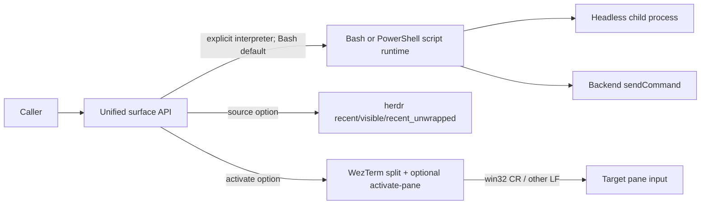

# Fix Windows PowerShell support in pi-terminal-mux

## Overview

修复 `pi-terminal-mux` 在 Windows 11 PowerShell/WezTerm/herdr 组合下的命令提交、长命令脚本、读屏来源和分屏激活问题，同时保持 POSIX 与现有调用签名兼容。成功标准是四项行为均可通过公开统一 API 使用，并由不依赖真实 Windows、WezTerm 或 herdr 进程的确定性测试覆盖。

## Problem Frame

Issue #90 报告了四个相关缺口：WezTerm 在 Windows ConPTY 中发送 LF 会让 PowerShell 停在续行提示；`sendLongCommand` 固定生成并调用 Bash 脚本；统一 `readScreen` 无法转发 herdr 已支持的 `recent_unwrapped`；WezTerm 定向分屏无法选择激活新 pane。当前包的价值正是吸收后端探测与命令拼装，这些差异不应由调用方重复实现。

约束：

- 不改变现有 Bash 默认行为与前三个位置参数的调用方式；Windows 调用方通过新增 option 显式声明 PowerShell，不根据平台擅自重解释既有 Bash command。
- 后端不支持的能力继续保持统一 API 可移植，不因可选 herdr/WezTerm 参数而让其他后端报错。
- 不依赖维护者机器、真实 Windows、真实终端 CLI 或网络完成确定性测试。
- 本次只修复 `pi-terminal-mux` 的通用能力，不把 `pi-interactive-subagents` 内现有 Bash 命令、`.sh` 路径和 `$?` 数值哨兵生成器改写成 PowerShell；这些调用继续使用默认 Bash runtime。

## Scope Boundaries

- In scope：Windows WezTerm Enter 终止符；Bash/PowerShell 长命令脚本选择与安全路径引用；herdr 统一读屏 source 透传；WezTerm 分屏可选激活；公开类型、双语 README 与聚焦测试。
- Out of scope：抬升 WezTerm OS 窗口；为 tmux/wezterm 发明不存在的 `recent_unwrapped` 语义；把仓库内调用方生成的 Bash 命令自动翻译成 PowerShell；运行需要真实终端 pane 的本地集成测试。

## Context & Research

- Relevant code/patterns：
  - `packages/pi-terminal-mux/src/backends/wezterm.ts` / `ops.send`、`ops.createSplit`
  - `packages/pi-terminal-mux/src/surface.ts` / `createSurfaceSplit`、`sendLongCommand`、`readScreen`、`readScreenAsync`
  - `packages/pi-terminal-mux/src/backends/herdr.ts` / `readHerdrScreen`、`ops.read`
  - `packages/pi-terminal-mux/src/backends/types.ts` / `BackendOps`
  - `packages/pi-terminal-mux/src/headless.ts` / `spawnHeadlessProcess`
  - `packages/pi-terminal-mux/src/shell.ts` / shell 路径转义模式
  - `packages/pi-terminal-mux/tests/mux.test.ts` / 纯函数与后端行为测试风格
- Institutional learnings：仓库 `AGENTS.md` 要求公开行为更新测试和中英文文档，测试不得依赖本机布局或外部 CLI。
- External references：Issue #90 的 Windows 11 实测证据；未引入额外外部 API。

## Key Technical Decisions

- WezTerm 仅在 `process.platform === "win32"` 时用 CR 提交命令，其他平台保留 LF；不用 CRLF，避免对已确认只需 CR 的 ConPTY 发送多余换行。
- `sendLongCommand` 在现有 options 中新增 `interpreter?: "bash" | "powershell"`。为兼容仓库内既有 Bash command、显式 `.sh` 路径和 `$?` 数值哨兵，所有平台默认仍为 Bash；Windows PowerShell 调用方显式选择 `powershell`。显式 `scriptPath` 原样保留；自动路径按解释器选择 `.ps1` 或 `.sh`。
- PowerShell mux 路径通过 `powershell.exe -NoLogo -NoProfile -ExecutionPolicy Bypass -File <path>` 执行，路径使用 PowerShell 单引号规则；Bash 路径继续使用现有 `shellEscape`。`spawnHeadlessProcess` 不改变参数个数，只在现有 options 中增加同一 interpreter，Bash 使用现有 `bash -c`，PowerShell 使用 `powershell.exe -NoLogo -NoProfile -ExecutionPolicy Bypass -Command <command>`；`sendLongCommand` 的 headless PowerShell 分支传 `& <escaped-script-path>`，避免外层仍依赖 Bash。
- `readScreen`/`readScreenAsync` 增加可选 options，仅 herdr 转发 `source`；其他后端忽略该能力提示并保持各自既有读屏语义。herdr 默认仍为当前统一 API 的 `recent`，确保不改变调用方结果。
- `createSurfaceSplit` 在现有 `fromSurface` 后增加 options，`activate` 默认 false；只有 WezTerm 执行 `activate-pane`，其他后端保持不变。

## Open Questions

- Resolved during planning：
  - 是否发送 CR 或 CRLF → 采用 issue 已实测可执行且副作用更小的 CR。
  - herdr source 是否扩散成所有后端强契约 → 否，仅作为可选能力由 herdr 消费，统一调用方无需分支。
  - 是否默认激活新 pane → 否，保持当前焦点行为，显式 opt-in。
  - Windows 是否自动切换 PowerShell → 否。默认 Bash 是现有公共契约；调用方用 `interpreter: "powershell"` 显式声明 command/preamble 的语法，库不翻译 Bash command 或 `$?` 哨兵。
  - PowerShell 启动机制 → mux 使用 `powershell.exe ... -File`，headless 使用 `powershell.exe ... -Command` 直接执行 `& <script>`；两者均带 `-ExecutionPolicy Bypass`。
- Deferred to implementation：仅确认 Node `spawn` 参数数组与脚本内容的具体代码布局；解释器、参数和默认值已在计划中冻结，通过聚焦单元测试锁定，不在本机启动真实 PowerShell pane。

## High-Level Technical Design

## Implementation Units

### U-001. Windows WezTerm commands submit exactly once

- **Goal:** Windows WezTerm pane 收到可提交 PowerShell 输入的 CR，非 Windows 行为不变。
- **Requirements:** Issue #90 第 1 项；Acceptance 第 1 项。
- **Dependencies:** none
- **Files:**
  - Modify: `packages/pi-terminal-mux/src/backends/wezterm.ts`
  - Test: `packages/pi-terminal-mux/tests/mux.test.ts` 或同包新增聚焦测试文件
- **Approach:** 将平台到命令终止符的决策收敛为实际 `ops.send` 使用的可测试逻辑；win32 追加 `\r`，其他平台追加 `\n`。
- **Behavior boundary:** `sendCommand(surface, command)` 仍只提交一次命令；调用方不传平台参数。
- **Patterns to follow:** `packages/pi-terminal-mux/src/backends/wezterm.ts` 的 `execFileSync` 参数数组；现有纯规划/解析函数测试模式。
- **Acceptance scenarios:**
  - Happy path: win32 生成以 CR 结尾的 `send-text --no-paste` payload。
  - Edge/error: POSIX 仍生成 LF，命令正文不被改写。
  - Integration: `ops.send` 使用被测试的终止符决策。
- **Verification:** package test + typecheck。

### U-002. Long commands support an explicit PowerShell runtime

- **Goal:** `sendLongCommand` 可在调用方显式选择后生成并执行 PowerShell `.ps1`，同时在所有平台完整保留现有 Bash 默认路径。
- **Requirements:** Issue #90 第 2 项；Acceptance 第 2 项。
- **Dependencies:** U-001（WezTerm mux 中提交 PowerShell `-File` 命令需要 CR；headless PowerShell 路径可独立验证）。
- **Files:**
  - Modify: `packages/pi-terminal-mux/src/surface.ts`
  - Modify: `packages/pi-terminal-mux/src/headless.ts`
  - Modify: `packages/pi-terminal-mux/src/shell.ts`（若路径转义收敛于现有 shell 工具模块）
  - Modify: `packages/pi-terminal-mux/src/mux.ts`
  - Test: `packages/pi-terminal-mux/tests/mux.test.ts` 或同包新增聚焦测试文件
- **Approach:** 定义并导出 `SendLongCommandOptions`，增加 `interpreter?: "bash" | "powershell"`；默认固定为 Bash，显式 PowerShell 时选择 `.ps1`、CRLF、无 Bash shebang 的脚本内容和 PowerShell 路径转义。mux 使用 `powershell.exe -NoLogo -NoProfile -ExecutionPolicy Bypass -File <path>`；headless 通过 `spawnHeadlessProcess` 现有 options 新增的 interpreter，以 `powershell.exe -NoLogo -NoProfile -ExecutionPolicy Bypass -Command "& <path>"` 启动。Bash 继续 shebang、可执行位、`bash <path>` 和 `bash -c`。
- **Behavior boundary:** 未传 interpreter 时，Windows 与非 Windows 都维持现有 Bash command、显式 `.sh`、`scriptPreamble` 和 `$?` 数值哨兵语义；只有显式选择 PowerShell 时 command/preamble 才按 PowerShell 语法解释，库不做 shell 语法翻译。显式 `scriptPath` 原样保留。
- **Patterns to follow:** `surface.ts` 当前脚本落盘与 `shell.ts` 的集中转义职责；`spawnHeadlessProcess` 继续负责进程与日志生命周期且不改变公开参数个数。
- **Acceptance scenarios:**
  - Happy path: `interpreter: "powershell"` 生成 `.ps1`、保留 PowerShell preamble/command，并为 mux 构造安全的 `-File` 调用、为 headless 构造直接 PowerShell child。
  - Edge/error: 路径含单引号时正确转义；Windows 上未传 interpreter 且显式 `.sh`/Bash command 时仍写 Bash 脚本并走 Bash；PowerShell command 的退出哨兵若需要数值码由调用方使用 `$LASTEXITCODE`，库不把 Bash `$?` 自动翻译。
  - Integration: mux PowerShell 路径依赖 U-001 提交命令；仓库内 `pi-interactive-subagents` 未传 interpreter，因此现有 `.sh` 与 `__SUBAGENT_DONE_<数字>__` 生命周期契约不变。
- **Verification:** 脚本内容、默认优先级、路径转义和 headless/mux 启动参数单元测试，package test + typecheck；不运行真实 pane 集成测试。

### U-003. Unified reads expose herdr capture fidelity

- **Goal:** 调用方可通过统一同步/异步读屏 API 选择 herdr `recent_unwrapped`。
- **Requirements:** Issue #90 第 3 项；Acceptance 第 3 项。
- **Dependencies:** none
- **Files:**
  - Modify: `packages/pi-terminal-mux/src/backends/herdr.ts`
  - Modify: `packages/pi-terminal-mux/src/surface.ts`
  - Modify: `packages/pi-terminal-mux/src/mux.ts`
  - Modify: `packages/pi-terminal-mux/src/index.ts`
  - Test: `packages/pi-terminal-mux/tests/mux.test.ts` 或同包新增聚焦测试文件
- **Approach:** 提取公开 herdr source 类型并为 `readScreen`/`readScreenAsync` 增加尾部 options；检测为 herdr 时把 source 转发给 `readHerdrScreen`，未提供时保持 `recent`。其他 backend 和 headless 继续忽略该后端特有选项并按原逻辑读屏。
- **Behavior boundary:** 旧两参数调用结果不变；`recent_unwrapped` 映射为 herdr CLI 的 `recent-unwrapped`；不宣称其他 backend 支持软换行合并。
- **Patterns to follow:** `readHerdrScreen` 已有 source 映射；`surface.ts` 的显式非对称 backend 分派。
- **Acceptance scenarios:**
  - Happy path: 同步和异步统一 API 都向 herdr 发送 `--source recent-unwrapped`。
  - Edge/error: 不传 options 时仍为 `recent`；非 herdr 后端不新增参数或报错。
  - Integration: `pollForExit` 的现有 `readScreenAsync(surface, lines)` 行为不变。
- **Verification:** 参数映射/默认值测试、package test + typecheck。

### U-004. WezTerm splits may opt in to pane activation

- **Goal:** 调用方可要求激活新创建的 WezTerm pane，同时默认不改变焦点。
- **Requirements:** Issue #90 Minor；Acceptance 第 4 项。
- **Dependencies:** none
- **Files:**
  - Modify: `packages/pi-terminal-mux/src/backends/types.ts`
  - Modify: `packages/pi-terminal-mux/src/backends/wezterm.ts`
  - Modify: `packages/pi-terminal-mux/src/surface.ts`
  - Modify: `packages/pi-terminal-mux/src/mux.ts`
  - Test: `packages/pi-terminal-mux/tests/mux.test.ts` 或同包新增聚焦测试文件
- **Approach:** 在保持 `fromSurface` 第三参数兼容的前提下增加 `CreateSurfaceSplitOptions` 第四参数并透传给 BackendOps；WezTerm 在 split 成功并拿到 pane id 后按 `activate` 调用 `wezterm cli activate-pane --pane-id <id>`。
- **Behavior boundary:** `activate` 默认 false；只能激活 pane，明确不承诺抬升 OS 窗口；其他 backend 忽略该 option。
- **Patterns to follow:** WezTerm 现有 split 后 `set-tab-title` 调用与 optional cosmetic 行为边界；统一 API 尾部可选参数。
- **Acceptance scenarios:**
  - Happy path: `activate: true` 对新 pane id 发出一次 `activate-pane`。
  - Edge/error: 默认不激活；split id 非法仍按既有错误失败，不执行激活。
  - Integration: 旧 `createSurfaceSplit(name, direction, fromSurface)` 调用继续通过类型检查。
- **Verification:** CLI 参数构造/调用次序测试、package test + typecheck。

### U-005. Public contract and bilingual documentation stay aligned

- **Goal:** 用户能从公开类型和双语文档正确使用新增能力。
- **Requirements:** Acceptance 第 5 项；仓库公开行为文档约束。
- **Dependencies:** U-001, U-002, U-003, U-004
- **Files:**
  - Modify: `packages/pi-terminal-mux/README.md`
  - Modify: `packages/pi-terminal-mux/README.zh-CN.md`
  - Modify as needed: `packages/pi-terminal-mux/src/index.ts`, `packages/pi-terminal-mux/src/mux.ts`
- **Approach:** 更新 API 表和聚焦示例，说明 Bash 默认、Windows PowerShell 显式 interpreter、herdr-only source、WezTerm-only activation 及默认兼容行为；导出调用方需要命名引用的 options/source 类型。
- **Behavior boundary:** 文档不承诺抬升 OS 窗口或为所有后端提供 unwrapped capture。
- **Patterns to follow:** 两份 README 保持完整平行入口；公共类型由 `mux.ts`/`index.ts` barrel 透出。
- **Acceptance scenarios:**
  - Happy path: TypeScript 调用示例可由 package typecheck 覆盖。
  - Edge/error: 后端特有能力和忽略语义写清楚，避免调用方误判。
  - Integration: package dry-run pack 包含更新后的 README 和源码。
- **Verification:** package check + repository `npm run check`。

## 执行交接信息

### 依赖与冲突

- U-001/U-003/U-004 可独立实现，但共同修改 `surface.ts`、测试和导出面，放在同一 Execution Issue/branch 串行落地可避免高冲突合并。
- U-002 触及 headless 进程启动契约，应在文档最终定稿前完成。
- U-005 依赖全部行为签名稳定后执行。

### U-ID 顺序

1. U-001：先锁定最直接的 Windows 命令提交回归。
2. U-002：建立跨平台脚本 runtime，完成主要 Windows 可用性。
3. U-003：扩展统一读屏 options，保持默认值兼容。
4. U-004：扩展分屏 options 并实现 WezTerm 激活。
5. U-005：按最终签名同步公共导出与双语文档。

### 集成验证点

- 每个行为先跑 `pi-terminal-mux` 定向测试与 typecheck。
- 最终运行该 package `npm run check`，再运行仓库 `npm run check`，确认 workspace 调用方仍可编译、测试、打包且未违反本地绑定策略。

### 执行期遗留

- 本机不是 Windows，不能直接复现 ConPTY/PowerShell pane；以 issue 的实测输入纪律和确定性参数/脚本测试作为本地证据，PR 中明确请求报告者或 Windows CI 复验真实 pane。

## System-Wide Impact

- Interaction / dependency graph：统一 surface API → BackendOps/非对称 herdr 分派 → WezTerm/herdr/headless；公开参数只尾部新增，可保持仓库内现有调用点源码兼容。
- Error and state lifecycle：split/read/send 原有同步异常继续向上传播；可选激活若 WezTerm CLI 返回失败应明确抛出，不能静默假装激活成功；现有 cosmetic title failure 仍可忽略。
- Shared API/invariant：`sendCommand` 表示“输入命令并提交一次”；`readScreen` 旧调用默认值不变；`activate` 默认 false；`sendLongCommand` 返回实际脚本路径。
- Integration coverage：聚焦单元测试覆盖平台/解释器/source/options 组合，仓库 gate 覆盖跨 workspace 类型兼容；真实终端集成因本地副作用和平台缺失不在本机运行。

## Risks & Dependencies

| Risk / dependency | Mitigation / owner |
|---|---|
| PowerShell 与 Bash 的转义规则不同 | 分离解释器 runtime 与路径 escape，并测试单引号路径 |
| Windows 上既有调用方仍传 Bash command、`.sh` 和 `$?` 哨兵 | 所有平台默认继续 Bash；仅显式 `interpreter: "powershell"` 时切换，仓库 gate 验证旧调用方 |
| headless shell 改动影响现有 POSIX 调用方 | 不改变参数个数和默认 `bash -c`；仅 options 显式选择时 spawn PowerShell，并跑仓库全量 gate |
| herdr source 选项被误解为跨后端保证 | 类型/README 标注 herdr-only，非 herdr 保持原语义 |
| activate-pane 无法抬升 OS 窗口 | 文档明确仅激活 WezTerm pane，不承诺 foreground window |
| 无真实 Windows 环境 | 参数级确定性测试 + PR 明示 Windows 复验限制 |

## Documentation / Operational Notes

更新 `packages/pi-terminal-mux/README.md` 与 `README.zh-CN.md`。不手工修改 release-please 管理的版本与 changelog。

## Sources & References

- Origin：https://github.com/maplezzk/pi-extensions/issues/90
- Code：`packages/pi-terminal-mux/src/surface.ts`、`src/backends/wezterm.ts`、`src/backends/herdr.ts`、`src/headless.ts`、`src/backends/types.ts`
- Repository rules：`AGENTS.md`
