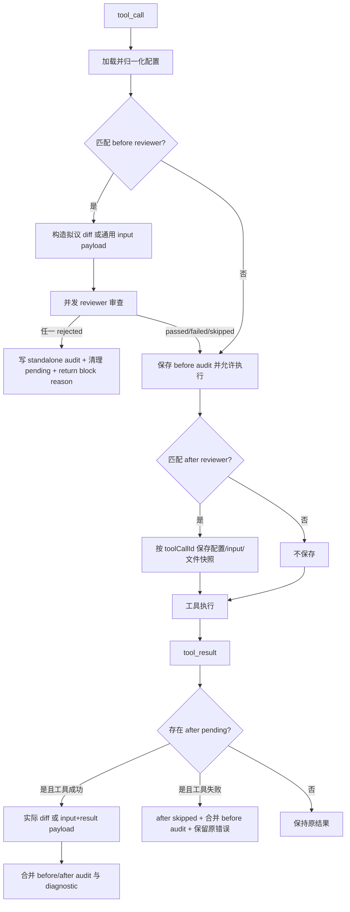

# Generalize pi-tool-supervisor tool review lifecycle

## Overview

将 `pi-tool-supervisor` 从固定审查 `edit`/`write` 实际 diff 的后置扩展，扩展为每个 reviewer 可选择工具范围和 `before`/`after` 触发时机。旧配置继续默认只对 `edit`/`write` 做后置实际 diff 审查；前置审查明确拒绝时通过 Pi 原生 `tool_call` block 机制阻断执行。

## Problem Frame

当前运行时只在 `tool_call` 为 `edit`/`write` 时保存文件快照，并在 `tool_result` 后审查实际 diff。它无法覆盖 `bash`、`read`、自定义工具等调用，也无法在副作用发生前拒绝操作。新增能力必须满足：

- 不破坏未声明新字段的旧配置与现有 diff 审查语义；
- 不假设任意工具都有文件路径或可生成 diff；
- 前置拒绝使用 Pi 原生阻断，后置拒绝仍只能诊断、不能伪装成回滚；
- 模型、规则或序列化失败不得静默吞掉，继续沿用明确报告且 fail-open 的现有错误语义；
- 新增用户文案同时提供 `zh-CN` 与 `en-US`。

## Scope Boundaries

- In scope：每 reviewer 工具选择、通配全部工具、before/after 触发、前置明确拒绝阻断、任意工具输入/结果审查载荷、edit/write diff 特化、配置 UI、审计展示、测试与双语文档。
- Out of scope：回滚已执行工具、OS 沙箱、权限系统、按失败类型配置 fail-open/fail-closed、同时在 before 和 after 运行同一 reviewer、工具参数改写、自动发现规则语义。

## Context & Research

- Relevant code/patterns：
  - `packages/pi-tool-supervisor/src/index.ts`：`prepareFileReviewCall`、`reviewToolResult`、`tool_call`/`tool_result` 注册。
  - `packages/pi-tool-supervisor/src/review-utils.ts`：配置归一化、规则选择、实际 diff 与审查 prompt。
  - `packages/pi-tool-supervisor/src/tool-display-bridge.ts`：当前仅允许 `edit`/`write` 的结果中间件。
  - `packages/pi-tool-supervisor/src/fallback-renderer.ts`：结构化审计卡片与兼容 fallback entry。
  - `packages/pi-tool-supervisor/tests/pi-tool-supervisor.test.ts`：配置、prompt、事件接线与展示测试模式。
- External references：
  - Pi `docs/extensions.md`：`tool_call` 在执行前串行触发并可返回 `{ block: true, reason }`；`tool_result` 在执行后以 middleware patch 结果。
  - Pi `dist/core/extensions/types.d.ts`：`ToolCallEvent`、`ToolCallEventResult`、`ToolResultEvent` 的真实类型。
  - Pi `examples/extensions/permission-gate.ts`、`protected-paths.ts`：原生前置阻断模式。

## Key Technical Decisions

### ADR-1. 将工具范围和触发时机配置在 reviewer 层

- 决策：为 reviewer 增加 `tools: string[]` 与 `trigger: "before" | "after"`。`tools` 支持具体工具名和单独的 `"*"`；字段省略时归一化为 `["edit", "write"]` 与 `"after"`。
- 备选：在顶层配置全局工具范围和触发时机。
- 权衡：reviewer 层允许不同模型/规则分别守护不同工具，满足用户明确选择；代价是配置 UI 每个 reviewer 多两个字段。
- 可逆性：中。字段进入公开示例和 README 后应保持兼容。

### ADR-2. 保持 diff 特化，并为其他工具构造通用审查载荷

- 决策：`edit`/`write` 的 after 审查继续使用执行前后文件快照生成实际 diff；before 审查使用执行参数生成拟议 diff。其他工具 before 审查工具名与结构化 input；仅当工具成功时，after 额外包含最终 content/details/isError。工具失败沿用现有 skipped 语义，不调用 after reviewer，并原样保留错误结果。通用载荷使用安全序列化，并按现有 `maxOutputChars` 截断审查输入，所有载荷都作为不可信数据包裹在审查 prompt 中。
- 备选：所有工具统一只序列化 input/result，不再生成实际 diff。
- 权衡：保留现有最有价值的真实 diff 语义，同时让任意工具具备可审查内容；实现需区分文件工具和通用工具。
- 可逆性：易。

### ADR-3. 前置明确拒绝始终阻断，审查故障继续放行

- 决策：任一适用 before reviewer 返回 `rejected` 时，`tool_call` 返回 `{ block: true, reason }`；规则读取、模型、超时、序列化或 abort 形成显式 failed/skipped 诊断，但不把故障冒充拒绝。未阻断调用的 before audit 按 `toolCallId` 保存，并在随后必然发生的 `tool_result` 中与 after audit 合并；blocked 调用在返回前删除 pending，通过 block reason 向 Agent 返回完整诊断，并用 fallback audit entry 展示结构化结果。after 拒绝继续追加诊断，不声称回滚。
- 备选：新增 `blockOnReject` 或失败策略开关。
- 权衡：用户已明确选择“始终拦截”，同时保持现有故障 fail-open 契约，避免扩展未要求的策略矩阵。
- 可逆性：中。

### ADR-4. 通用工具只使用无文件模式限制的规则

- 决策：`edit`/`write` 继续按实际文件路径应用 reviewer/rule 的 `filePatterns`；其他工具只应用未声明 `filePatterns` 的启用规则，并继续遵守现有 local/editor-review consumer 约束。`tools` 是工具选择器，不把空路径伪装成文件匹配。
- 备选：通用工具无条件加载 reviewer 的全部规则，忽略 `filePatterns`。
- 权衡：避免把 Java/TypeScript 文件规则误用于 bash 或自定义工具；要审查通用工具时需使用不带文件模式的规则文件，README 和示例会明确说明。
- 可逆性：易。

## Open Questions

- Resolved during planning：配置粒度采用每 reviewer；before 明确拒绝始终阻断；旧配置默认范围和时机保持不变。
- Deferred to implementation：无。Pi runner 已核实 blocked call 不进入实际执行后的 `tool_result` 链，因此在 `tool_call` 返回 block 前清理 pending 并写 standalone audit entry。

## High-Level Technical Design

## Implementation Units

### U-001. 可配置的任意工具前后置审查

- **Goal:** 用户可为每个 reviewer 选择工具与触发时机；before 拒绝阻断，after 审查返回结构化结果，同时保持旧 diff 默认行为。
- **Requirements:** Issue #98 的全部 Acceptance；用户确认的 reviewer 级配置与始终阻断语义。
- **Dependencies:** none
- **Files:**
  - Modify: `packages/pi-tool-supervisor/src/review-utils.ts`
  - Modify: `packages/pi-tool-supervisor/src/index.ts`
  - Modify: `packages/pi-tool-supervisor/src/tool-display-bridge.ts`
  - Modify: `packages/pi-tool-supervisor/src/fallback-renderer.ts`
  - Modify: `packages/pi-tool-supervisor/tests/pi-tool-supervisor.test.ts`
  - Modify: `packages/pi-tool-supervisor/locales/index.json`
  - Modify: `packages/pi-tool-supervisor/locales/review-utils.json`
  - Modify: `packages/pi-tool-supervisor/locales/fallback-renderer.json`（仅实际新增展示字段时）
  - Modify: `packages/pi-tool-supervisor/config.example.json`
  - Modify: `packages/pi-tool-supervisor/README.md`
  - Modify: `packages/pi-tool-supervisor/README.zh-CN.md`
  - Modify: `packages/pi-tool-supervisor/package.json`（仅描述文本）
- **Approach:** 将配置和审计类型泛化为工具审查概念，同时保留旧配置字段与 `details.fileEditReview` 读取兼容；提取工具/trigger 匹配、载荷构造、规则适用性和统一 reviewer 执行函数。配置层先按 reviewer 的 `tools`/`trigger` 匹配；规则层对 edit/write 应用 `filePatterns`，对其他工具只接受无 `filePatterns` 的规则。规则读取 errors 与可用 rules 分开聚合，即使全部规则读取失败也形成 failed reviewer 结果。`tool_call` 执行 before reviewers：明确拒绝写 standalone audit、清理 pending 并 block；未拒绝则保存 before audit 和 after 所需快照。`tool_result` 对成功工具执行 after reviewers并合并两阶段 audit，对失败工具跳过 after review、合并已有 before audit且保留原错误。展示中间件从固定工具白名单改为仅按 audit 是否存在决定渲染。
- **Behavior boundary:** 缺少新字段的配置行为不变；`tools: ["*"]` 匹配内建与自定义工具；before reviewer 只审查执行前可见数据，after reviewer 只审查成功工具的实际结果；只有明确 `rejected` 阻断，`failed`/`skipped` 不阻断且必须通过后续 tool result 或 blocked standalone entry 可见。
- **Patterns to follow:** 现有 `loadFileEditReviewConfig` 的兼容归一化、`reviewWithModel` 的 parent signal + timeout、`getOverallReviewStatus` 的状态优先级、Pi 官方 permission gate 的 block 返回值、现有 tool-display middleware 协议。
- **Acceptance scenarios:**
  - Happy path：旧配置省略 `tools`/`trigger` 时，write 完成后审查实际 diff；配置 `tools:["bash"], trigger:"before"` 时审查 command，passed 后执行；配置 `tools:["*"], trigger:"after"` 时自定义工具结果被审查并展示。
  - Edge/error：before 任一 reviewer rejected 返回完整 block reason 与 standalone audit；另一个 reviewer failed 不掩盖 rejected；只有 failed 时放行并在随后 tool result 报告；全部规则文件读取失败也生成 failed 结果且不调用模型；工具失败跳过 after reviewer、保留原错误并合并已有 before audit；无匹配 reviewer、无实际文件变化或 parent abort 时保持明确 skipped/原结果语义；非法 tools/trigger 使该 reviewer 无效并产生配置警告，`["*", "bash"]` 归一化为 `["*"]` 并警告。
  - Integration：交互式配置可编辑并持久化 tools/trigger；tool-display 对非 edit/write 的 audit 渲染；README 示例可直接表达默认、精确工具和全部工具。
- **Verification:** 包级 `npm run typecheck --workspace pi-tool-supervisor`、`npm test --workspace pi-tool-supervisor`、`npm run check --workspace pi-tool-supervisor`；仓库级 `npm run check`。不运行本机 E2E。

## 执行交接信息

### 依赖与冲突

- U-001 是一个共享运行时与配置契约的单一 vertical slice；拆成配置、runtime、UI 会造成水平分层并需要共享高冲突文件，不拆票。
- `src/index.ts`、`src/review-utils.ts` 与单一测试文件高度耦合，应在同一 worktree 顺序实现。

### U-ID 顺序

1. U-001：完成配置、运行时、展示、文档和验证后即可交付。

### 集成验证点

- 配置归一化测试覆盖旧默认、具体工具、`*`、`*` 混用警告、before/after 与非法值。
- 规则适用性测试覆盖 edit/write 文件模式、generic 无模式规则、generic 文件模式规则跳过，以及全部规则读取失败仍产生 failed。
- 事件接线测试覆盖 before-only passed/failed/skipped/rejected、blocked 无 tool_result、pending 清理、工具失败 after skipped，以及 after generic/diff 路径。
- 最终执行包级门禁和仓库 `npm run check`。

### 执行期遗留

- 无；blocked call 不触发执行后的 `tool_result` 已从 Pi runner 核实，测试 harness 只需固定该契约和 pending 清理。

## System-Wide Impact

- Interaction / dependency graph：Pi `tool_call`/`tool_result` → supervisor 配置/规则 → review model → block 或 result patch → tool-display middleware。
- Error and state lifecycle：before rejected 阻断；before failed/skipped 放行并明确报告；after rejected/failed 追加诊断；pending 按 `toolCallId` 隔离并在生命周期结束时清理。
- Shared API/invariant：公开 JSON 配置新增 reviewer `tools`/`trigger`，省略时保持旧默认；不注册替代工具。
- Integration coverage：配置 loader、prompt/payload、事件 handler、audit renderer 和 package/repository gates。

## Risks & Dependencies

| Risk / dependency | Mitigation / owner |
|---|---|
| 前置模型审查增加工具调用延迟 | 继续使用 reviewer 并发、独立 timeout 与 parent abort；仅匹配配置的 reviewer 才运行。 |
| 自定义工具 input/details 无法 JSON 序列化或体积很大 | 使用处理循环引用与 bigint 的安全序列化，按 `maxOutputChars` 截断审查 payload 并标记截断；无法序列化形成明确 failed 诊断，不吞异常。 |
| 多扩展会修改 `event.input` | 遵循 Pi 扩展加载顺序语义，只审查当前 handler 实际看到的 input，并在文档说明不是权限沙箱。 |
| after 审查无法撤销副作用 | 文案和 README 明确区分 before block 与 after diagnostic。 |
| 旧消费方读取 `details.fileEditReview` | 保留兼容读取/写入路径，泛化内部语义而不强制迁移。 |

## Documentation / Operational Notes

更新双语 README 与 `config.example.json`，说明：省略字段的兼容默认、`"*"` 通配、before 明确拒绝阻断、审查故障 fail-open、after 不回滚。所有路径示例保持可移植，不写入维护者本机默认。

## Sources & References

- Origin：https://github.com/maplezzk/pi-extensions/issues/98
- Code：`packages/pi-tool-supervisor/src/index.ts`、`packages/pi-tool-supervisor/src/review-utils.ts`、`packages/pi-tool-supervisor/src/tool-display-bridge.ts`
- Pi docs：`/opt/homebrew/lib/node_modules/@earendil-works/pi-coding-agent/docs/extensions.md`
- Pi examples：`permission-gate.ts`、`protected-paths.ts`
