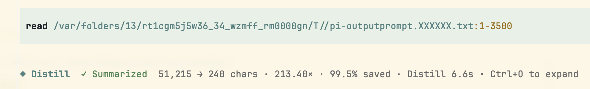

# pi-distill

> **保留事实，把上下文留给决策。**

`pi-distill` 是一个 Pi 扩展：它不替换工具，也不改变命令的执行方式，只在工具已经返回真实结果之后，帮助 Agent 决定哪些内容值得进入下一轮上下文。

## 解决什么问题

编码 Agent 通常只需要命令、搜索或文件读取结果中的关键信息。把大段日志、生成文件或搜索结果完整塞入下一轮，会增加上下文消耗，也容易让有效信号被噪声淹没。`pi-distill` 在不替换 Pi 内置工具的前提下，增加一层结果级提炼。

## 实际上下文节省效果

构建日志、diff 输出和测试报告经常包含重复状态行、未变化上下文、堆栈噪声，以及下一步决策并不需要的细节。这些内容通常很适合高比例压缩。下面这张真实 Pi 会话截图中，结果从 51,215 个字符压缩到 240 个字符：**213.40 倍压缩，输出字符减少 99.5%**。



截图统计的是字符减少比例，不是 tokenizer 得出的精确 token 统计。实际使用时通常会带来同量级的上下文 token 节省，但精确数值取决于语言、内容和模型 tokenizer。对于适合压缩的冗长输出，90% 以上是已经观察到的效果，但不是每个命令的保证；需要完整输出时请使用 `RAW`。

| 场景 | 常见噪声 | 提炼结果保留 |
| --- | --- | --- |
| 构建 / 编译 | 重复进度、警告和未变化的环境信息 | 成功/失败、首个可行动错误、受影响文件和后续步骤 |
| Diff 检查 | 大量未变化 hunk 和格式化噪声 | 变更文件、相关 hunk 和评审所需事实 |
| 测试 | 单测逐条输出、snapshot 和框架模板 | 总数、失败用例、关键断言和有效诊断 |

## Prompt 语言

提炼 prompt 会严格跟随 `/pi-language` 当前选择的语言。持久化语言发生变化后，下一次工具调用会读取新设置，即使语言命令和 `pi-distill` 来自不同的包实例也可以同步。`PI_EXTENSIONS_LOCALE` 仍然是显式的环境变量覆盖项。原始用户消息只作为语言上下文传入，不能覆盖已选择的语言。

## 工作方式

- 通过 Pi 原生的 `tool_call` / `tool_result` 事件监听 `bash`、`read`、`grep` 和 `find`。
- 以工具的 `outputPrompt` 作为是否提炼、如何提炼的依据。
- 当提示词严格只有 `RAW` 时，视为明确要求返回原始输出。
- 默认使用当前会话模型，也可以配置独立的 `provider/model`。
- 在工具结果 details 中保留状态、字符数、压缩比、耗时和异常等诊断信息。
- 提炼结果或最终返回结果过大时写入临时文件，只把文件路径返回给 Agent，避免工具结果失控膨胀。
- 当前 Pi 展示中间件可用时显示紧凑审计卡片，否则使用自己的 fallback renderer。展示协议由公共运行库 `pi-extensions-tool-display` 提供。

它不会注册第二个 `bash`、`read`、`grep` 或 `find` 工具。

## 安装

```bash
pi install npm:pi-distill
```

安装后重新加载 Pi：

```text
/reload
```

交互式配置命令：

```text
/pi-distill
```

## 核心思想

我们不是想让 Agent 少看信息，而是避免它为了找一句结论，被迫把几千行日志一起带进上下文。

工具执行层需要保留完整事实；Agent 消费层需要控制上下文成本。`pi-distill` 在两者之间增加一个可选的结果处理层：

- 工具负责执行并返回事实；
- Agent 通过 `outputPrompt` 表达自己关心什么；
- 扩展读取真实输出后，再决定是否调用提炼模型；
- 模型只压缩消费路径，不改变原工具的业务语义；
- 诊断信息记录这次处理是否真的节省了上下文。

因此，提炼不是“把所有输出都交给模型总结”，而是一份明确的工具契约：需要什么就提取什么，需要完整内容就保留原文。

## 为什么需要它

构建、测试和 diff 往往会返回大量重复状态、未变化上下文、框架模板和堆栈噪声。Agent 可能只需要失败原因、变更文件或最终状态，却被迫先消费整段输出。

直接截断会丢失关键事实；新增一个总结工具会增加调用链和决策负担；等 Agent 看完再总结又已经消耗了上下文。`pi-distill` 选择在结果进入后续推理前处理它，同时保留明确的原文模式和失败回退。

## 实际效果

下面是一段真实 Pi 会话中的输出：原始结果从 **51,215 个字符**提炼到 **240 个字符**，压缩 **213.40 倍**，输出字符减少 **99.5%**。


这张图统计的是字符减少比例，不是 tokenizer 得出的精确 token 数。实际 token 节省会受到语言、内容和模型 tokenizer 影响；对于适合压缩的构建日志、diff 和测试输出，90% 甚至更高的节省比例是已经观察到的结果，但不是每个命令的保证。

| 场景 | 原始输出中的典型噪声 | 提炼后优先保留 |
| --- | --- | --- |
| 构建 / 编译 | 重复进度、环境信息、重复警告 | 成功/失败、首个可行动错误、受影响文件、后续步骤 |
| Diff 检查 | 大量未变化 hunk、格式化噪声 | 变更文件、相关 hunk、评审所需事实 |
| 测试 | 逐条单测输出、snapshot、框架模板 | 总数、失败用例、关键断言、有效诊断 |

节省比例不是唯一指标。扩展还记录提炼耗时、原始字符数、结果字符数、压缩比和异常；如果总结没有带来真实收益，会暴露 `ineffective-compression`，而不是静默假装优化成功。

## 工作原理

一次工具调用的处理链路如下：

```text
Agent 提出处理目标
        ↓ 通过 outputPrompt 传给工具
工具执行真实操作，返回 stdout / stderr / 文件内容 / 多媒体结果
        ↓
pi-distill 根据真实结果和配置决定：原样返回、调用模型提炼，或写入文件
        ↓
Agent 消费更适合当前决策的结果，并获得可审计的处理诊断
```

1. 扩展在会话启动时为所有已启用、参数 schema 为 object 的工具增加可选的 `outputPrompt` 参数，不写死 `bash`、`read`、`grep` 或 `find`。
2. `tool_call` 事件捕获这个参数，并在交给底层工具前移除它，因此原工具不会收到扩展专用字段。
3. `tool_result` 事件拿到真实输出后再做判断，不依赖 Agent 对输出长度的预测。
4. 没有 prompt 时跳过模型；严格的 `RAW` 表示明确要求原文；其他非空 prompt 才允许进入提炼流程。
5. 提炼失败、没有可用模型或结果收益过低时，扩展保留原始事实，并通过 details 和审计卡片暴露状态。

## 输出处理契约

| `outputPrompt` | 行为 | 适用场景 |
| --- | --- | --- |
| 未提供 | 不调用提炼模型，保留原始文本；超长文本仍可按最终返回上限写入临时文件 | 短输出或需要工具自行决定时 |
| 严格为 `RAW`（大小写不敏感） | 不调用提炼模型，保留完整原始文本；如超出返回上限则返回原文文件路径 | 逐字核对、复制内容、需要完整日志时 |
| 任意非空且非 `RAW` | 输出达到阈值后调用模型，具体保留内容由 prompt 决定 | “只保留错误、警告和最终状态”等场景 |
| 包含图片、音频或其他非文本内容 | 原样保留，不发送给提炼模型，不做文本长度截断 | 图片读取、二进制结果、混合文本与图片结果 |

`RAW` 是唯一明确的完整输出信号。自然语言里的“完整”“全部匹配”等表达可能有歧义，不会被扩展当作控制命令。

## Prompt 语言

提炼 prompt 完全跟随 `/pi-language` 当前选择的语言：

- 切换语言后，下一次工具调用读取新的持久化语言设置；
- 即使 `/pi-language` 和 `pi-distill` 来自不同的包实例，也通过共享 locale 设置同步；
- `PI_EXTENSIONS_LOCALE` 可以作为显式环境变量覆盖；
- 原始用户消息只作为任务上下文传入，不会把中文用户消息误判成中文 prompt。

## 覆盖范围与边界

- 自动处理所有当前已启用且参数 schema 为 object 的工具；能否注入 `outputPrompt` 由工具 schema 决定，不维护固定工具名单。
- 不注册替代工具，不改变原工具的执行语义，也不依赖无关的 npm 包 `pi-tool-display`。
- 文本提炼是有损操作；完整性要求应使用 `RAW`。
- 非文本结果是完整性边界：图片、音频、二进制和混合 content 不进入文本提炼链路。
- 提炼结果或最终文本过大时写入临时文件并返回路径，避免上下文无限膨胀。
- 当前会话没有模型时，提炼会失败并保留原始结果，不阻止 Pi 启动。

## 配置

默认配置路径：

```text
~/.pi/agent/extensions/pi-distill/config.json
```

可以从 [`config.example.json`](./config.example.json) 开始：

```json
{
  "enabled": true,
  "model": "",
  "minChars": 200,
  "maxChars": 100000,
  "maxOutputChars": 10000,
  "timeoutSeconds": 10,
  "missedCompressionRatio": 10,
  "summarizeErrors": true,
  "render": {
    "enabled": true,
    "showPrompt": true,
    "showResult": true
  }
}
```

配置文件字段优先于环境变量。未声明的字段依次回退到 `PI_DISTILL_*`、旧版 `PI_BASH_SUMMARY_*` 变量和默认值。

| 配置项 | 含义 |
| --- | --- |
| `model` | 可选的 `provider/model`；为空时使用当前 Pi 会话模型。 |
| `minChars` | 达到此输出长度后才请求提炼。 |
| `maxChars` | 模型提炼结果超过此长度时写入文件。 |
| `maxOutputChars` | 返回给 Agent 的最大文本长度，超出后写入文件。 |
| `timeoutSeconds` | 提炼模型调用的最长等待时间。 |
| `missedCompressionRatio` | 没有提供摘要 prompt 时，用于长输出诊断的倍数阈值。 |
| `summarizeErrors` | 工具返回错误时是否仍发送给提炼模型。 |
| `render.*` | 控制审计卡片、prompt 预览和结果预览。 |

主要环境变量包括 `PI_DISTILL_MODEL`、`PI_DISTILL_MIN_CHARS`、`PI_DISTILL_MAX_CHARS`、`PI_DISTILL_MAX_OUTPUT_CHARS`、`PI_DISTILL_TIMEOUT_SECONDS`、`PI_DISTILL_MISSED_COMPRESSION_RATIO` 和 `PI_DISTILL_SUMMARIZE_ERRORS`。

## 要求

- Node.js 22 或更高版本。
- 当前 Pi 会话需要有可用模型，除非 `model` 指向一个已配置且可用的模型。

## 许可证

[MIT](../../LICENSE)
